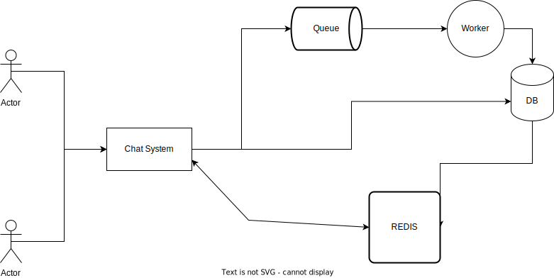

[](https://travis-ci.org/YuKitAs/rails-rest-api)

# Rails Chat System Rest API

## Project Setup




**Bring up the API**:

```console
docker-compose up -d --build
```

**Create database and Update the database with new data model**:

```console
$ docker exec -ti chatsystem_web_1 rake db:create
$ docker exec -ti chatsystem_web_1 rake db:migrate
```


## API Documentation
**-Refer to** 
```
localhost:3000/apipie
```
**-You can also refer to 'Chat System.postman_collection.json' file**
## Use Case Examples

**Create a new application**:

```console
$ curl -X POST -H 'Content-type: application/json' -d '{"name": "test app 1"}' localhost:3000/applications
```

**Create a new chat**:

```console
$ curl -X POST -H 'Content-type: application/json' -d '{"application": "043e82f4291e704139e37bebbad836"}' localhost:3000/chats
```

**Create a new message**:

```console
$ curl -X POST -H 'Content-type: application/json' -d '{"application": "043e82f4291e704139e37bebbad836", "chat": 0, "message": hi there}' localhost:3000/chats
```

**Get all chats related to a certain application**:

```console
$ curl -X GET -H 'Content-type: application/json' localhost:3000/api/v1/applications/<application-token>/chats
```

**Get all messages related to a certain chat**:

```console
$ curl -X GET -H 'Content-type: application/json' localhost:3000/api/v1/applications/<application-token>/chats/<chat-number>/messages
```

**Search messages**:

```console
$ curl -X POST -H 'Content-type: application/json' -d '{"message": "Hi"}' localhost:3000/api/v1/messages/search
```