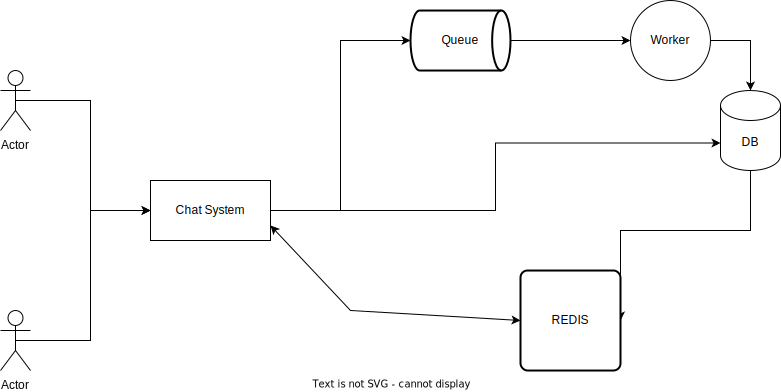

[](https://travis-ci.org/YuKitAs/rails-rest-api)

# Rails Chat System Rest API

## Requirements
**It’s required to build a chat system. The system should allow creating new applications where
each application will have a token(generated by the system) and a name(provided by the client).
The token is the identifier that devices use to send chats to that application.
Each application can have many chats. a chat should have a number. Numbering of chats in
each application starts from 1 and no 2 chats in the same application may have the same
number. The number of the chat should be returned in the chat creation request. A chat
contains messages and messages have numbers that start from 1 for each chat. The number of
the message should also be returned in the message creation request. The client should never
see the ID of any of the entities. The client identifies the application by its token and the chat by
its number along with the application token.
Add an endpoint for searching through messages of a specific chat. It should be able to partially
match messages’ bodies. You must use ElasticSearch for this.
The applications table should contain a column called chats_count that contains the number of
chats for this application. Similarly, the chats table should contain a column called
messages_count that contains the number of messages in this chat. These columns don’t have
to be live. However, they shouldn’t be lagging more than 1 hour.
Assume that the system is to receive many requests. It might be running on multiple servers in
parallel and thus multiple requests may be processed concurrently. Make sure to handle race
conditions. Try to minimize the queries and avoid writing directly to MySQL while serving the
requests(especially for the chats and messages creation endpoints). You can use a queuing
system to achieve that. It is allowed for chats and messages to take time to be persisted. You
should optimize your tables by adding appropriate indices.**


## High Level System design



## Components
1. Ruby on Rails v5
1. MYSQL v5.7
2. Redis v6.2
3. RabbitMQ v3
4. ElasticSearch v6.4.1

## Project Setup

**Bring up the API**:

```console
docker-compose up -d --build
```

**Create database and Update the database with new data model**:

```console
$ docker exec -ti chatsystem_web_1 rake db:create
$ docker exec -ti chatsystem_web_1 rake db:migrate
```


## API Documentation
**-Refer to** 
```
localhost:3000/apipie
```
**-You can also refer to 'Chat System.postman_collection.json' file**
## Use Case Examples

**Create a new application**:

```console
$ curl -X POST -H 'Content-type: application/json' -d '{"name": "test app 1"}' localhost:3000/applications
```

**Create a new chat**:

```console
$ curl -X POST -H 'Content-type: application/json' -d '{"application": "043e82f4291e704139e37bebbad836"}' localhost:3000/chats
```

**Create a new message**:

```console
$ curl -X POST -H 'Content-type: application/json' -d '{"application": "043e82f4291e704139e37bebbad836", "chat": 0, "message": hi there}' localhost:3000/chats
```

**Get all chats related to a certain application**:

```console
$ curl -X GET -H 'Content-type: application/json' localhost:3000/api/v1/applications/<application-token>/chats
```

**Get all messages related to a certain chat**:

```console
$ curl -X GET -H 'Content-type: application/json' localhost:3000/api/v1/applications/<application-token>/chats/<chat-number>/messages
```

**Search messages**:

```console
$ curl -X POST -H 'Content-type: application/json' -d '{"message": "Hi"}' localhost:3000/api/v1/messages/search
```